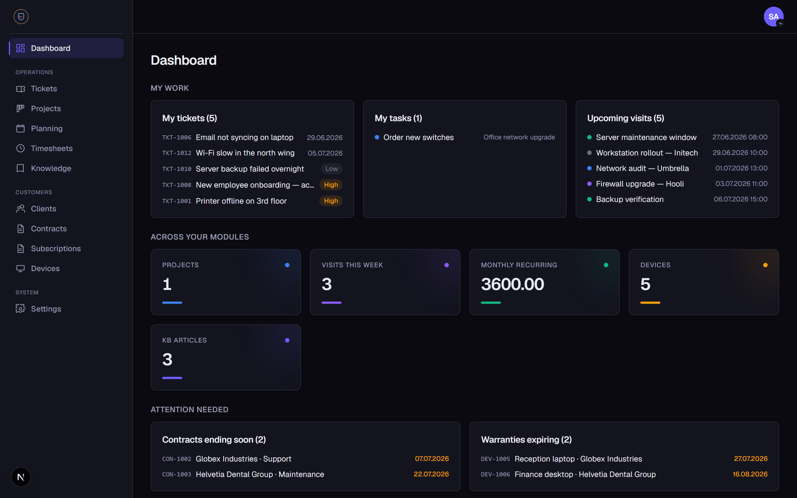
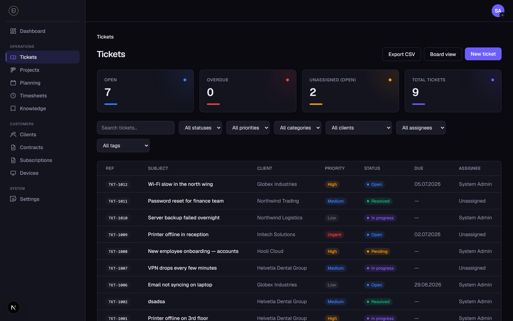
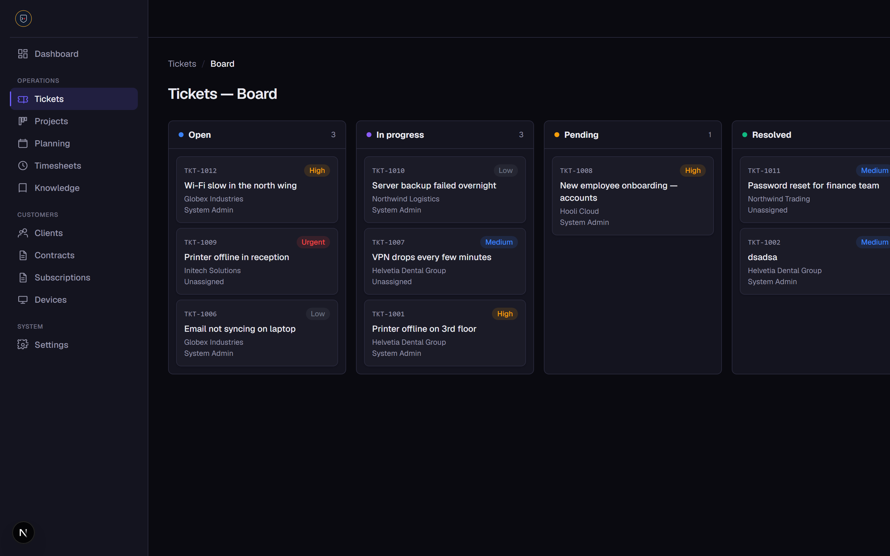
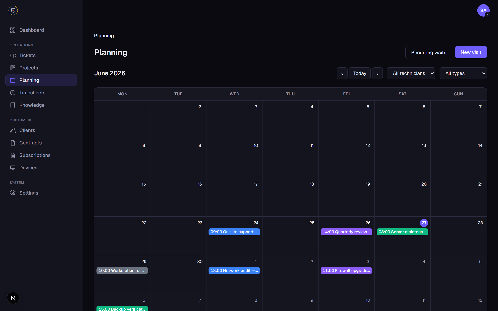
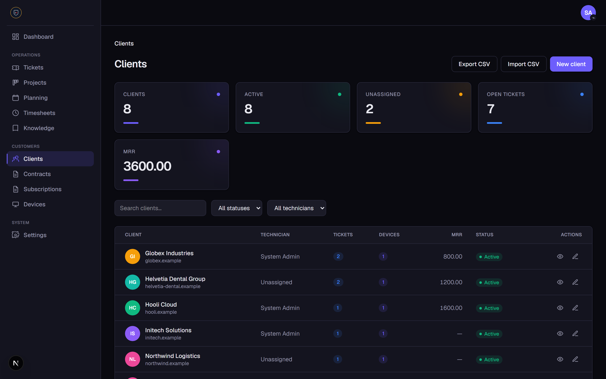
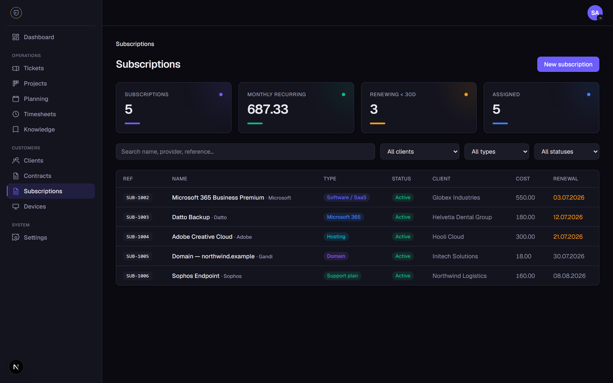
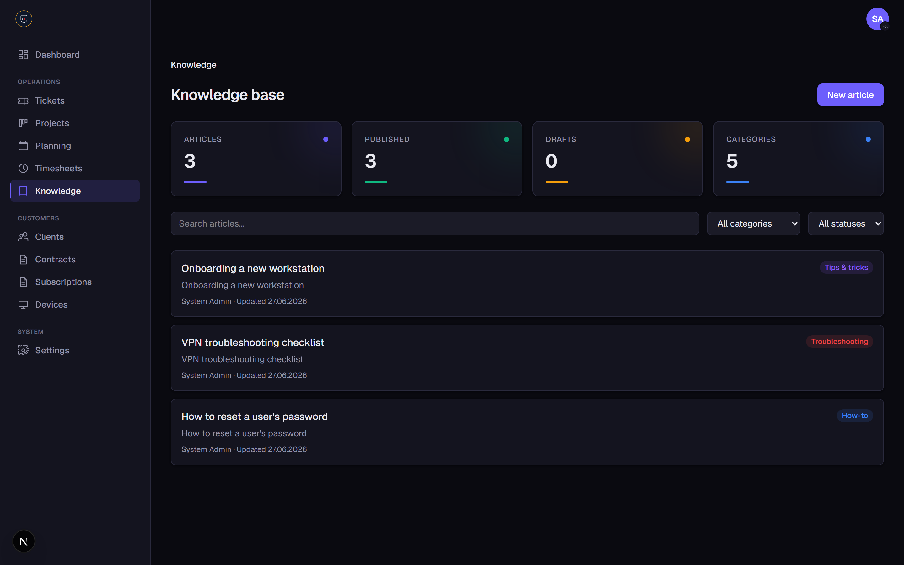
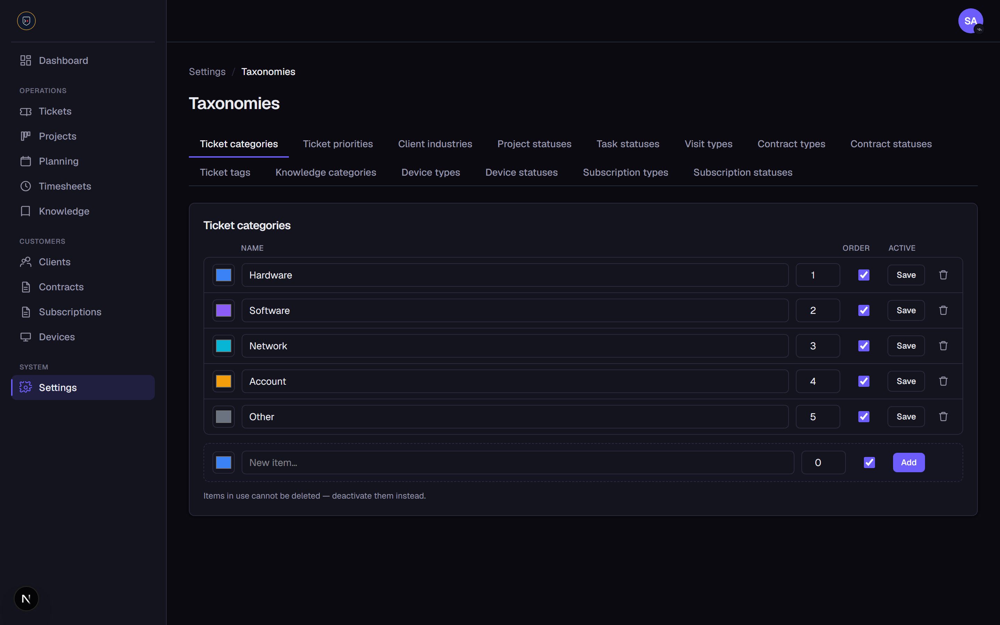

<div align="center">

# OpsCenter

**The all-in-one operations platform for Managed Service Providers.**

Tickets · ITSM · CRM · CMDB · Planning · Clients · Contracts · Subscriptions · Devices · Knowledge base · Timesheets — in one premium, bilingual workspace.



</div>

---

OpsCenter is a single-tenant SaaS that runs the day-to-day of an MSP: handle support tickets with ITSM practices, drive sales through a CRM pipeline, map your estate in a CMDB, schedule field visits, monitor devices with a deployable agent, track client assets and subscriptions, log billable time, and give clients their own portal — all behind a granular role-based permission system, with a full audit trail, in English or French, with a light or dark theme.

## ✨ Highlights

- 🎫 **Ticketing** with a Kanban board, SLA/due dates, tags, threaded conversations and an automatic activity log
- 🛠️ **ITSM practices** — incident, service request and change ticket types
- 🔄 **Change management** with risk/impact, planned windows, implementation/rollback plans and an approval workflow
- 🐞 **Problem management** with root cause, workaround, known-error flag and resolution
- 🚀 **Release management** with versions, planned/actual dates, release notes and rollback plans
- 🧱 **CMDB** — configuration items with types, relationships and device links
- 💼 **CRM** — leads and an opportunity pipeline (board + analytics), per-deal activity timeline and email
- 🗓️ **Planning** on a full month calendar with one-off and recurring visits
- 👥 **Clients & contacts** with a customer-facing **portal**
- 📄 **Contracts & subscriptions** with renewals, warranties and support tracking
- 🖥️ **Device / asset** management with a **deployable monitoring agent** (live CPU/RAM/disk/OS metrics)
- 📚 **Knowledge base** (Markdown), publishable to the client portal
- ⏱️ **Timesheets & billing** with approval workflow and per-client PDF reports
- 🧾 **Audit log** recording who did what and when across the app
- 🔐 **Roles & permissions**, 2FA, and a self-service password reset
- 🌍 **Bilingual (EN/FR)** per user · 🌗 **light / dark** theme
- 🧩 **Toggleable modules** and **configurable taxonomies** everywhere

---

## 📸 Features

### Dashboard
Your personalized starting point: a **My work** panel (tickets, tasks and visits assigned to you), KPI cards across every enabled module, an **Attention needed** section surfacing contracts ending soon, warranties expiring and subscriptions renewing, plus tickets-by-status and recent activity.


### Ticketing
Tickets are linked to clients with status, priority, configurable category, tags, due dates (with overdue flagging) and friendly reference numbers (`TKT-####`). Work them in a **filterable list with KPIs** or a **drag-and-drop Kanban board**. Each ticket has a threaded comment conversation, an automatic activity timeline, optional email notifications, and inline auto-saving controls.





### ITSM: change, problem & release management
Classify tickets by **type** (incident, service request, change) to align with ITSM practice, backed by three dedicated _(optional)_ modules:

- **Change Management** (`CHG-####`) — configurable type and status, **risk/impact**, a **planned window**, **implementation and rollback plans**, assignee and client, plus an **approve / reject** workflow gated by its own permission. KPIs for pending approval, upcoming and approved.
- **Problem Management** (`PRB-####`) — track the problems behind recurring incidents with **priority** (low → critical), **impact**, **root cause**, **workaround**, a **known-error** flag and a **resolution** (which marks the problem resolved). KPIs for open, known errors and resolved.
- **Release Management** (`REL-####`) — plan and track releases with a **version**, type and status, owner, client, **planned and actual release dates**, **release notes** and a **rollback plan**. KPIs for planned, upcoming and released.

### CRM & sales pipeline _(optional module)_
Capture **leads** (`LEAD-####`) with source, status, owner, contact details and estimated value, and drive **opportunities** (`OPP-####`) through a **configurable pipeline** with stages, monetary value, win probability, owner, expected close date and a won/lost outcome. Convert a qualified lead into a client in **one click**, carrying over its company and contact details.

The pipeline is a **drag-and-drop Kanban board** (with per-stage deal counts and value) or a list, with overdue deals flagged. A tabbed view (Pipeline / Leads / Analytics) surfaces KPIs — open deals, pipeline value, **weighted forecast**, won deals and active leads — plus an **Analytics** tab with win rate, average deal size, average sales cycle and pipeline-by-stage. Each opportunity has an **activity timeline** (notes plus an automatic history of stage/outcome changes), and you can **email** an opportunity's client contact or a lead directly from the record when SMTP is configured. CRM KPIs and deals closing soon also surface on the dashboard.

### CMDB / configuration management _(optional module)_
Map your IT estate as **configuration items** (`CI-####`) — servers, applications, services and network gear — with configurable type and status, owner, environment, location, client, an optional **linked monitored device** and **CI-to-CI relationships**, all filterable with KPIs.

### Planning
Schedule one-off and **recurring** visits for technicians on a **month calendar** with localized month/weekday names, colored chips per visit type, today highlighting and month navigation. Recurring templates (daily / weekly / monthly) generate dated occurrences you can reschedule, complete or cancel individually.



### Clients & contacts
Manage clients with search and status/technician filters. Each row shows an avatar, key chips (open tickets, devices, monthly recurring revenue) and a status pill. The client detail aggregates tickets, projects, visits, contracts, subscriptions, devices and contacts. Import and export clients as CSV.



### Contracts & subscriptions
Track **contracts** (type with a default hourly rate, status, value, billing cycle and an included-hours quota that shows live usage vs the timesheets) and **subscriptions** (renewals, warranties, support plans — provider, cost, seats, renewal and coverage dates, auto-renew). Both surface KPIs and feed the dashboard's renewal/expiry alerts.



### Devices & assets, with a monitoring agent
Inventory client and internal devices with configurable type and status, serial / manufacturer / model, hostname, purchase and warranty dates, and client assignment — with warranty-expiring alerts and links to related tickets. Each device has a **detail page with live system metrics** (online/offline status, OS, CPU, memory, disk, IP, last seen) shown as usage gauges. Generate a per-device token and deploy the provided **PowerShell (Windows)** or **bash (Linux/macOS)** agent on the workstation; it reports metrics to a token-authenticated endpoint.

### Knowledge base
Write internal articles in **Markdown** (how-tos, troubleshooting, tips, policies) with configurable categories, draft / published status and search. Publish selected articles to the **client portal** so customers can self-serve.



### Timesheets & billing _(optional module)_
Log time against tickets, tasks, visits or a client via a manual form or a **live start/stop timer**. Each entry carries a billable flag and an hourly rate (inherited from the client's contract type). A submit → approve/reject workflow feeds a per-client **monthly report** you can download as a PDF or email as an attachment.

### Client portal
A separate external area (`/portal`) where client contacts sign in with their own isolated session to view their company's tickets, open new ones, reply on the conversation, and browse published knowledge articles — strictly scoped to their own client, with per-contact capabilities (view / create / comment) and their own language choice.

### Roles & permissions
A granular permission catalog with per-route guards. Ships with three starter roles — **Admin** (full access), **Manager** (runs operations and the team, no system configuration) and **Technician** (day-to-day work, no access to settings) — all editable, plus a full permission matrix to define your own.

### Configurable taxonomies
Categories, priorities, statuses, types and tags across every module are **database-backed and editable** in Settings → Taxonomies — color, order and active state included.



### Bilingual & theming
Every user picks their own **language (English / French)** and **light / dark theme** from the avatar menu in the top bar; the choice is remembered and applied instantly across the app and the client portal.

### Audit log
A chronological record of **who did what and when** across the app, with entity/action filters and search. Actions are recorded best-effort across clients, devices, subscriptions, contracts, knowledge articles, tickets, changes, configuration items and CRM records. Gated by a dedicated "View audit log" permission.

### Security
Email/password sign-in with signed-cookie sessions and route protection, self-service **password reset** (emailed, time-limited, single-use hashed tokens), optional **two-factor authentication** (TOTP authenticator app with backup codes) and an organization-wide enforce-2FA policy.

---

## 🧰 Tech stack

**Next.js** (App Router, Server Actions, TypeScript) · **PostgreSQL** · **Prisma** · **Tailwind CSS** · **Docker** · custom session auth (argon2 + `jose`) · Vitest.

## 🚀 Getting started

**Prerequisites:** Node.js 20 and Docker Desktop.

Copy `.env.example` to `.env` and fill in:

| Variable         | Description                                          |
|------------------|------------------------------------------------------|
| `DATABASE_URL`   | PostgreSQL connection string (set by Docker).        |
| `AUTH_SECRET`    | Secret used to sign session JWTs (≥ 32 chars).       |
| `ADMIN_EMAIL`    | Email for the bootstrap admin (used by the seed).    |
| `ADMIN_PASSWORD` | Password for the bootstrap admin (used by the seed). |

```bash
npm install                 # 1. install dependencies
docker compose up -d db     # 2. start PostgreSQL
cp .env.example .env        # 3. configure environment
npx prisma migrate dev      # 4. apply migrations
npm run db:seed             # 5. seed permissions, roles & the admin user
npm run dev                 # 6. start the app
```

The app runs at **http://localhost:3000**. Sign in at `/login` with the seeded admin:

- Email: `admin@opscenter.local` (or your `ADMIN_EMAIL`)
- Password: `ChangeMe123!` (or your `ADMIN_PASSWORD`)

## 🧪 Tests

```bash
npm run test
```

## 📚 Documentation

- Docker deployment: [`docs/deployment-docker.md`](docs/deployment-docker.md)
- ADR — custom session auth: [`docs/decisions/0001-custom-session-auth.md`](docs/decisions/0001-custom-session-auth.md)
- Changelog: [`CHANGELOG.md`](CHANGELOG.md)
